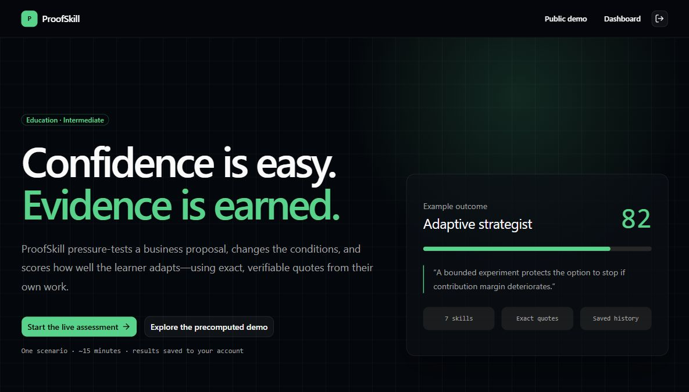

# ProofSkill

**Confidence is easy. Evidence is earned.**

ProofSkill is an AI-powered product strategy assessment for the Education category. It tests whether someone can make, adapt, and defend a coherent product decision under pressure - then returns a persistent, evidence-backed skill report.

[Live app](https://proofskill-blond.vercel.app) | [Public demo](https://proofskill-blond.vercel.app/demo) | [Devpost draft](https://devpost.com/software/proofskill)



## What it does

ProofSkill replaces a traditional multiple-choice quiz with a realistic product decision exercise:

1. Sign in with a persistent account. Authenticated `/assessment/new` starts a Live AI Assessment only.
2. Build an e-commerce strategy through eight guided selection cards.
3. Receive an adaptive constraint generated by GPT-5.6.
4. Revise the strategy using structured choices for each affected field.
5. Make a final critical decision through four required card groups: strategic path, rationale, first action, and stop guardrail. There are no writing fields in this step.
6. Receive a report with a score, seven competencies, exact evidence, contradictions, a primary gap, and a next challenge.
7. Return to the private dashboard to reopen the result or resume an incomplete attempt.

The public `/demo` route contains a precomputed fixture and is explicitly labeled as such. It is the only public demonstration route; live assessments require authentication and use the OpenAI API.

Processing overlays keep the learner informed while Submit strategy saves and generates the pressure test, Lock revision saves the adaptation, Submit for evaluation saves and evaluates the final decision, and an evaluation retry runs.

## Why it matters

Most assessments reward recall or self-reported confidence. ProofSkill evaluates observable decision behavior: framing, prioritization, adaptation, trade-offs, measurement, and consistency. This makes the result useful as a learning artifact instead of another disposable quiz score.

## Trust boundary

GPT-5.6 generates the adaptive constraint and a structured evaluation. It does not have final authority over the report.

Application code then:

- validates every positive quote against the learner's submitted text;
- applies deterministic competency weights, caps, and score adjustments;
- rejects fabricated evidence from the displayed report;
- stores the rubric version, model, score, evidence, and run metadata;
- keeps each result attached to its authenticated owner through Supabase Row Level Security.

This separation makes the report inspectable and repeatable while preserving the flexibility of an AI evaluator.

## How GPT-5.6 and Codex were used

### GPT-5.6

- `gpt-5.6-sol` generates the scenario-specific constraint with Structured Outputs.
- The same model evaluates the complete decision trail using a versioned schema.
- Constraint generation uses low reasoning effort; evaluation uses medium reasoning effort.
- Responses use `store: false` and a stable, non-identifying safety identifier.
- Refusals, timeouts, rate limits, and schema failures are handled separately.

### Codex

Codex was the primary Build Week development partner. It helped turn the product brief into vertical slices, implement the Next.js and Supabase architecture, create migrations and security policies, build the guided interaction model, write tests, diagnose production deployments, verify the OpenAI integration, and prepare the submission package. The final product decisions, credentials, external account setup, testing, and submission remain under human control.

## Architecture

```text
Browser
  -> Next.js 16 App Router on Vercel
       -> Supabase Auth (email/password, confirmation, Google OAuth)
       -> Protected Server Components and Route Handlers
            -> Supabase Postgres + RLS
            -> OpenAI Responses API (gpt-5.6-sol)
                 -> Zod Structured Outputs
                 -> deterministic evidence validation and scoring
```

Key boundaries:

- `@supabase/ssr` creates authenticated clients per request.
- Protected routes verify the user on the server; the proxy is only an additional convenience layer.
- Browser clients never receive the Supabase secret key or OpenAI key.
- Authenticated database grants are read-only. Server-owned mutations run through validated Route Handlers.
- Evaluation rows are unique per session for idempotency.

See [Architecture](docs/ARCHITECTURE.md) and [Security verification](docs/SECURITY_VERIFICATION.md) for details.

## Tech stack

- Next.js 16, React 19.2, TypeScript strict
- Tailwind CSS 4, Geist, shadcn/ui
- Supabase Auth, Postgres, Row Level Security
- OpenAI Responses API, Structured Outputs, Zod
- Vitest and Playwright
- Vercel Production

## Local setup

Prerequisites: Node.js 20+, npm, a Supabase project, and an OpenAI project with access to `gpt-5.6-sol`.

```bash
git clone https://github.com/danzulu/proofskill.git
cd proofskill
npm ci
cp .env.example .env.local
```

Configure `.env.local`:

```dotenv
OPENAI_API_KEY=
OPENAI_MODEL=gpt-5.6-sol
NEXT_PUBLIC_SUPABASE_URL=
NEXT_PUBLIC_SUPABASE_PUBLISHABLE_KEY=
SUPABASE_SECRET_KEY=
NEXT_PUBLIC_SITE_URL=http://localhost:3000
ENABLE_AI_FIXTURES=true
```

Apply the Supabase migration in `supabase/migrations`, configure Auth redirect URLs, then run:

```bash
npm run dev
```

Open `http://localhost:3000`. The public `/demo` route remains a precomputed fixture; authenticated assessment starts are Live AI only. Never commit `.env.local`.

## Demo and sample data

- Public fixture report: [proofskill-blond.vercel.app/demo](https://proofskill-blond.vercel.app/demo)
- The demo is precomputed and visibly marked.
- Live authenticated attempts are persisted per user and appear in the private dashboard.
- The judge account is confirmed and verified with a saved report; its credentials are shared only through Devpost's private judging instructions.

## Verification

```bash
npm run lint
npm run typecheck
npm run test
npm run test:e2e
npm run build
```

Or run the combined gate:

```bash
npm run check
```

`npm run test:e2e` starts and waits for the local development server automatically. Set `E2E_BASE_URL` to run the same public-demo test against a running Preview or Production URL instead; in that case Playwright does not launch a local server.

Fresh verification on July 20: the focused suite passed 7 files / 31 tests; `npm run test:e2e` passed the public-demo test (1/1); and `npm run check` passed lint, TypeScript, 15 Vitest files / 51 tests, and the production build. The exact tested artifact also passed an authenticated Preview walkthrough, a Production smoke test, and post-smoke Vercel runtime-log review. The remaining manual release checks are the final two-account isolation test and Google OAuth from an incognito window.

Coverage includes authentication helpers, state transitions, deterministic scoring, evidence validation, API persistence, guided assessment forms, processing states, and the public-demo end-to-end path.

## Current limitations

- One e-commerce scenario at Intermediate level.
- English-only interface.
- No organizations, public reports, certificates, payments, or user comparison.
- The public demo is a fixture; only authenticated live assessments call GPT-5.6.

## Build Week disclosure

The product was scoped and implemented as an individual OpenAI Build Week entry. Planning notes existed before the build; the application code, assessment flow, authentication, persistence, AI integration, tests, deployment, and submission materials were produced during Build Week. See [BUILD_WEEK_LOG.md](BUILD_WEEK_LOG.md).

## License

[MIT](LICENSE)
